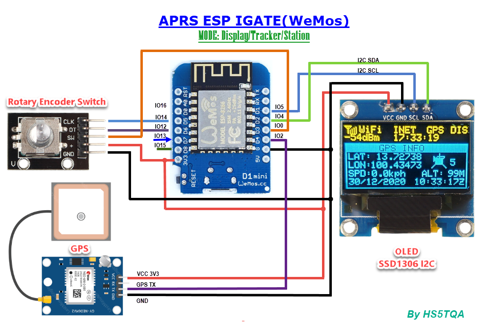
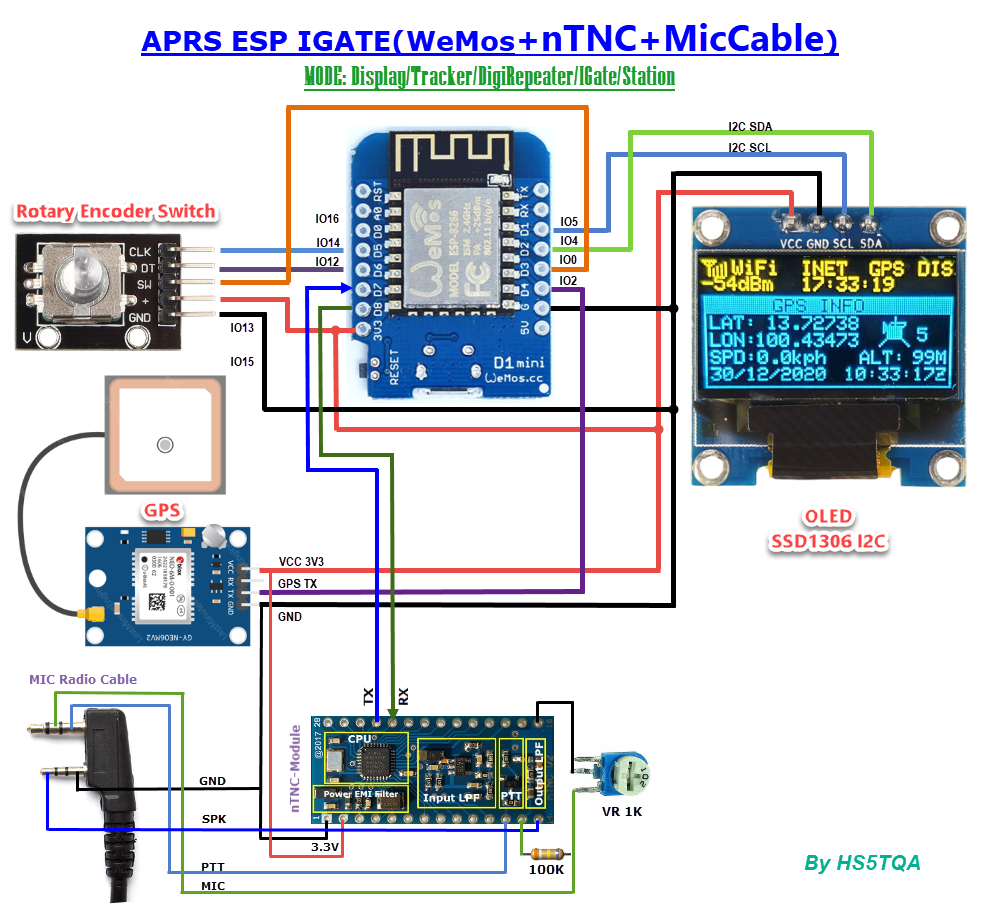
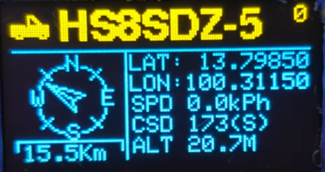
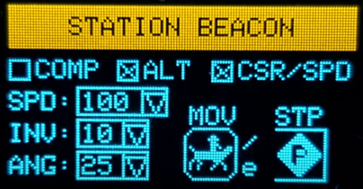
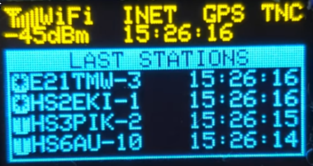
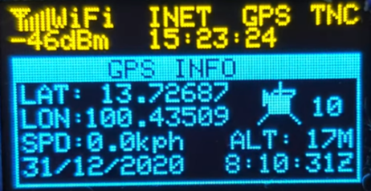

# ESP8266IGate Project
ESP826IGate is a Internet Gateway + Tracker + Display that is implemented for Espressif ESP82666 processor.
ESP8266 connect to wifi and decode or config display by OLED SD1306 or SH1106 and control by rotary swicth.

## Feature
- APRS Decode and Display monitor
- Package History 50 station
- Swap Display info and TNC2 Raw by push button
- Smart Beacon Tracker to TNC or WiFi Only Support
- OLED Bright control
- Push Rotory button to Manual TX
- Push Hold Rotory button to Display pause
- Popup display TX Status
- Compass Heat Up
- Display GPS Dash board
- nTNC-Module control and firmware support

## ESP8266IGate Circuit

## ESP8266IGate Screen Short

## TOOL & Firmware

- Tool Flash ESP8266 [here](Firmware/ESP8266Flasher.rar)
- Firmware V0.8 for OLED SD1306 0.96" [here](Firmware/ESP_IGate_SD1306.bin)
- Firmware V0.8 for OLED SH1106 1.3" [here](Firmware/ESP_IGate_SH1106.bin)
